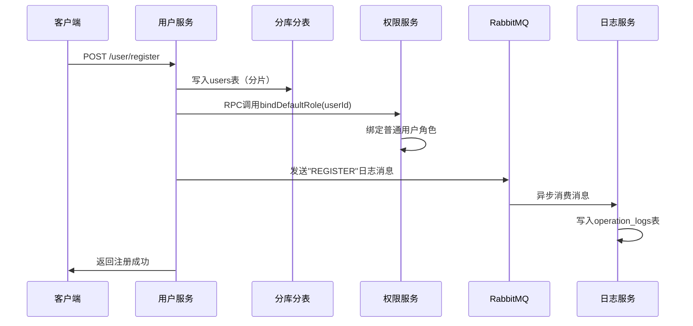
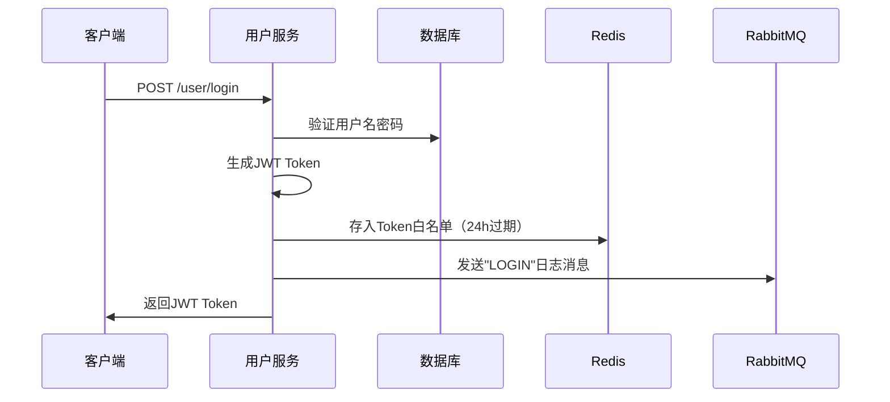
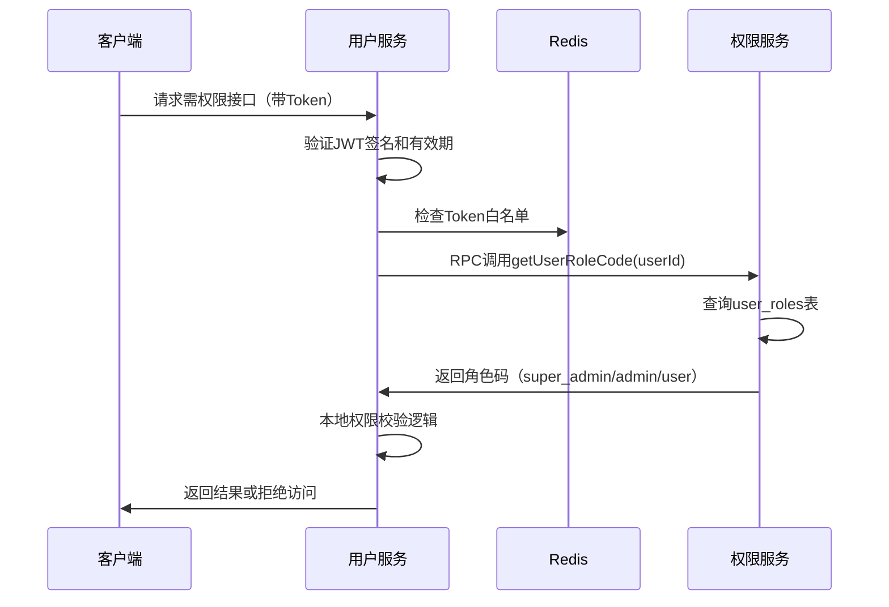
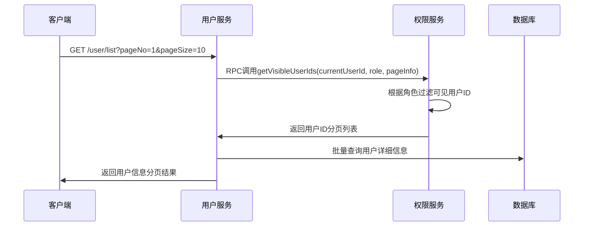
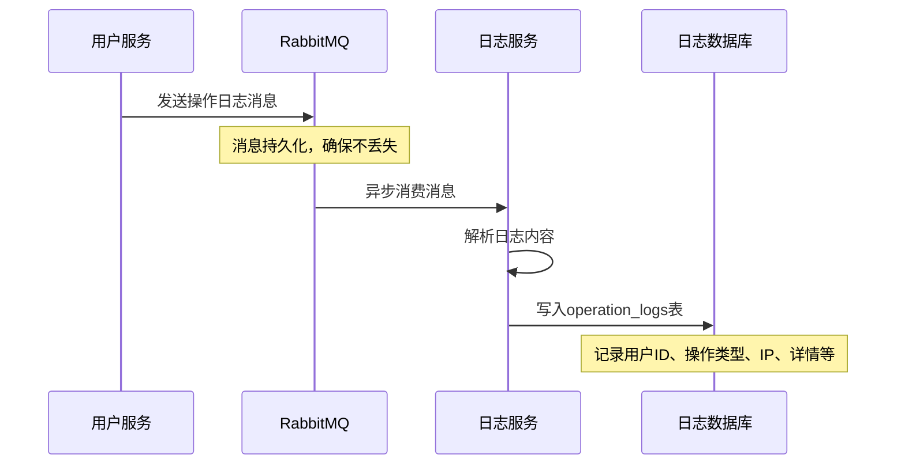

# 微服务用户权限管理系统

## 项目概述

这是一个基于Spring Cloud微服务架构的用户权限管理系统，实现了完整的用户管理、角色分级管理、操作日志异步记录、微服务间协作、分库分表实践和分布式事务保障。系统采用现代化的分布式架构设计，支持高并发、高可用的企业级应用场景。

## 目标与特性

### 核心目标
- **角色分级管理**: 普通用户、管理员、超级管理员三级权限体系
- **操作日志异步记录**: 通过MQ持久化关键操作日志
- **微服务间协作**: 用户服务与权限服务通过RPC通信
- **分库分表实践**: 用户表水平分片，支持大数据量
- **分布式事务**: 用户注册与角色绑定原子性保障

### 技术特性
- 微服务架构设计
- 分布式事务一致性
- 异步消息处理
- 数据库分片策略
- JWT + Redis白名单双重认证
- 基于角色的权限控制(RBAC)

## 系统架构

### 架构图

```
+-------------------+     +---------------------+     +----------------------+
|   User Service    |<--->|  Permission Service |<--->|  Logging Service     |
| (HTTP API + MQ)   |     | (RPC服务端)          |     | (MQ消费者)            |
+-------------------+     +---------------------+     +----------------------+
         |                           |                           |
         |                           |                           |
    +----------+              +----------+              +----------+
    | MySQL    |              | MySQL    |              | MySQL    |
    | (分库分表) |              | (单库)    |              | (单库)    |
    +----------+              +----------+              +----------+
         |                           |
         +---------------------------+
                     |
              +-------------+
              |   Redis     |
              | (Token白名单) |
              +-------------+
                     |
              +-------------+
              |  RabbitMQ   |
              | (操作日志)   |
              +-------------+
                     |
              +-------------+
              |   Nacos     |
              | (服务发现)   |
              +-------------+
                     |
              +-------------+
              |   Seata     |
              | (分布式事务) |
              +-------------+
```

### 服务模块详细说明

#### 1. User Service (用户服务)
**职责**:
- 用户注册/登录鉴权（JWT + Redis白名单）
- 分库分表管理用户数据
- 调用权限服务绑定角色（RPC调用）
- 发送操作日志至MQ（消息生产者）
- 用户信息CRUD操作
- 密码重置功能

**技术实现**:
- HTTP API接口提供
- ShardingSphere分库分表
- OpenFeign RPC调用
- RabbitMQ消息发送
- JWT Token生成与验证
- Redis白名单管理

#### 2. Permission Service (权限服务)
**职责**:
- 管理用户角色绑定（普通用户/管理员/超管）
- 提供RPC接口查询用户角色码
- 支持角色升级/降级
- 权限验证与过滤
- 可见用户ID分页查询

**技术实现**:
- RPC服务端接口
- 角色权限管理
- 数据权限过滤
- 单库存储角色数据

#### 3. Logging Service (日志服务)
**职责**:
- 异步消费MQ日志消息
- 持久化操作日志
- 审计追踪功能
- 日志查询与统计

**技术实现**:
- RabbitMQ消息消费者
- 异步日志处理
- 操作日志持久化
- 单库存储日志数据

#### 4. Common (公共模块)
**职责**:
- 通用工具类
- 统一响应格式
- 异常处理
- 公共配置
- 常量定义

### 技术栈

| 技术分类 | 技术选型 | 实现说明 |
|---------|---------|----------|
| **微服务框架** | Spring Boot 2.6.3, Spring Cloud | 微服务基础框架 |
| **数据库** | MySQL 8.0 + MyBatis Plus | 关系型数据库，ORM框架 |
| **分库分表** | ShardingSphere | 用户表水平分片，基于user_id散列 |
| **缓存** | Redis 5.0+ | Token白名单存储，提高认证安全性 |
| **服务发现** | Nacos | 服务注册与发现，配置管理 |
| **分布式事务** | Seata | 确保用户注册与角色绑定原子性 |
| **消息队列** | RabbitMQ | 异步操作日志记录 |
| **服务调用** | OpenFeign | 用户服务调用权限服务RPC接口 |
| **认证授权** | JWT + Redis白名单 | 双重验证机制，支持登出和强制下线 |
| **连接池** | Jedis | Redis连接池管理 |
| **序列化** | Jackson | JSON序列化，支持JSR310时间类型 |
| **工具库** | Hutool, Lombok | 工具类库，代码简化 |

## 权限体系

### 角色定义

1. **super_admin (超级管理员)**
   - 可以查看所有用户
   - 可以升级/降级用户角色
   - 拥有最高权限

2. **admin (管理员)**
   - 可以查看普通用户
   - 可以查看自己的信息
   - 不能查看其他管理员和超管

3. **user (普通用户)**
   - 只能查看自己的信息
   - 默认注册角色

### 权限控制逻辑

系统通过以下方式实现权限控制：

1. **用户查询权限**:
   - 超管：查看所有用户
   - 管理员：查看普通用户 + 自己
   - 普通用户：只查看自己

2. **分页查询优化**:
   - 权限服务先过滤可见用户ID
   - 用户服务根据ID列表查询详细信息
   - 避免大量RPC调用，提高性能

## 核心功能与业务流程

### 1. 用户注册流程（分布式事务）



**技术实现要点**:
- 使用Seata保证用户创建与角色绑定的原子性
- ShardingSphere根据user_id进行分库分表
- 异步MQ确保日志记录不影响主流程性能

### 2. 用户登录流程（JWT + Redis白名单）



**安全机制**:
- JWT Token包含用户基本信息和过期时间
- Redis白名单实现真正的Token控制
- 支持单点登出和强制下线

### 3. 权限验证流程（RPC协作）



**权限控制逻辑**:
- 超管：访问所有资源
- 管理员：访问普通用户资源 + 自己
- 普通用户：只访问自己的资源

### 4. 分页查询优化流程



**性能优化**:
- 权限服务只返回ID，减少数据传输
- 避免N+1查询问题
- 支持大数据量分页查询

### 5. 异步日志记录流程



**日志内容**:
- 用户注册、登录、登出
- 用户信息修改
- 角色升级/降级
- 密码重置等关键操作

## API 接口说明

### 用户服务接口

#### 1. 用户注册
```http
POST /user/register
Content-Type: application/json

{
  "username": "testuser",
  "password": "password123",
  "email": "test@example.com",
  "phone": "13800138000"
}
```

**响应示例**:
```json
{
   "code": 200,
   "message": "注册成功",
   "data": {
      "userId": 1001,
      "username": "testuser"
   }
}
```

**技术实现**:
- 分库分表：根据user_id散列到不同数据库
- 分布式事务：Seata确保用户创建与角色绑定原子性
- 异步日志：MQ发送注册日志消息

#### 2. 用户登录
```http
POST /user/login
Content-Type: application/json

{
  "username": "testuser",
  "password": "password123"
}
```

**响应示例**:
```json
{
  "code": 200,
  "message": "登录成功",
  "data": {
    "token": "eyJhbGciOiJIUzI1NiIsInR5cCI6IkpXVCJ9...",
    "expireTime": "2024-01-01T12:00:00",
    "userInfo": {
      "userId": 1001,
      "username": "testuser",
      "roleCode": "user"
    }
  }
}
```

#### 3. 分页用户列表
```http
GET /user/list?pageNo=1&pageSize=10
Authorization: Bearer {token}
```

**权限控制**:
- 普通用户：只返回自己的信息
- 管理员：返回所有普通用户信息
- 超管：返回所有用户信息

**响应示例**:
```json
{
  "code": 200,
  "data": {
    "total": 100,
    "pageNo": 1,
    "pageSize": 10,
    "records": [
      {
        "userId": 1001,
        "username": "testuser",
        "email": "test@example.com",
        "roleCode": "user",
        "createTime": "2024-01-01T10:00:00"
      }
    ]
  }
}
```

#### 4. 修改用户信息
```http
PUT /user/{userId}
Authorization: Bearer {token}
Content-Type: application/json

{
  "email": "newemail@example.com",
  "phone": "13900139000"
}
```

**权限控制**:
- 普通用户：只能修改自己
- 管理员：可修改普通用户
- 超管：可修改所有用户

#### 5. 密码重置
```http
POST /user/reset-password
Authorization: Bearer {token}
Content-Type: application/json

{
  "targetUserId": 1001,
  "newPassword": "newpassword123"
}
```

### 权限服务接口（RPC）

#### 接口定义
```java
@FeignClient(name = "permission-service")
public interface PermissionService {
    
    /**
     * 绑定默认角色（普通用户）
     * @param userId 用户ID
     */
    @PostMapping("/permission/bind-default-role")
    void bindDefaultRole(@RequestParam("userId") Long userId);
    
    /**
     * 查询用户角色码
     * @param userId 用户ID
     * @return 角色码：super_admin/admin/user
     */
    @GetMapping("/permission/user-role-code")
    String getUserRoleCode(@RequestParam("userId") Long userId);
    
    /**
     * 升级用户为管理员（仅超管可调用）
     * @param userId 目标用户ID
     */
    @PostMapping("/permission/upgrade-to-admin")
    void upgradeToAdmin(@RequestParam("userId") Long userId);
    
    /**
     * 降级用户为普通角色（仅超管可调用）
     * @param userId 目标用户ID
     */
    @PostMapping("/permission/downgrade-to-user")
    void downgradeToUser(@RequestParam("userId") Long userId);
    
    /**
     * 获取可见用户ID列表（分页查询优化）
     * @param currentUserId 当前用户ID
     * @param roleCode 当前用户角色
     * @param pageNo 页码
     * @param pageSize 页大小
     * @return 可见用户ID分页列表
     */
    @GetMapping("/permission/visible-user-ids")
    PageResult<Long> getVisibleUserIds(
        @RequestParam("currentUserId") Long currentUserId,
        @RequestParam("roleCode") String roleCode,
        @RequestParam("pageNo") Integer pageNo,
        @RequestParam("pageSize") Integer pageSize
    );
}
```

### 日志服务（MQ消费者）

#### 消息格式
```json
{
  "userId": 1001,
  "action": "REGISTER",
  "ip": "192.168.1.100",
  "detail": {
    "username": "testuser",
    "email": "test@example.com"
  },
  "timestamp": "2024-01-01T10:00:00"
}
```

#### 支持的操作类型
- `REGISTER`: 用户注册
- `LOGIN`: 用户登录
- `LOGOUT`: 用户登出
- `UPDATE_USER`: 修改用户信息
- `RESET_PASSWORD`: 密码重置
- `UPGRADE_ROLE`: 角色升级
- `DOWNGRADE_ROLE`: 角色降级

## 数据库设计

### 分库分表策略

#### ShardingSphere配置
```yaml
spring:
  shardingsphere:
    datasource:
      names: ds0,ds1
      ds0:
        type: com.zaxxer.hikari.HikariDataSource
        driver-class-name: com.mysql.cj.jdbc.Driver
        jdbc-url: jdbc:mysql://localhost:3306/user_db_0
      ds1:
        type: com.zaxxer.hikari.HikariDataSource
        driver-class-name: com.mysql.cj.jdbc.Driver
        jdbc-url: jdbc:mysql://localhost:3306/user_db_1
    rules:
      sharding:
        tables:
          users:
            actual-data-nodes: ds$->{0..1}.users_$->{0..1}
            table-strategy:
              standard:
                sharding-column: user_id
                sharding-algorithm-name: users-table-inline
            database-strategy:
              standard:
                sharding-column: user_id
                sharding-algorithm-name: users-database-inline
        sharding-algorithms:
          users-database-inline:
            type: INLINE
            props:
              algorithm-expression: ds$->{user_id % 2}
          users-table-inline:
            type: INLINE
            props:
              algorithm-expression: users_$->{user_id % 2}
```

### 用户表（分库分表）

```sql
-- 在每个分片数据库中创建
CREATE TABLE users_0 (
    user_id BIGINT PRIMARY KEY,
    username VARCHAR(50) UNIQUE NOT NULL COMMENT '用户名',
    password VARCHAR(255) NOT NULL COMMENT '密码（BCrypt加密）',
    email VARCHAR(100) COMMENT '邮箱',
    phone VARCHAR(20) COMMENT '手机号',
    status TINYINT DEFAULT 1 COMMENT '状态：1-正常，0-禁用',
    gmt_create TIMESTAMP DEFAULT CURRENT_TIMESTAMP COMMENT '创建时间',
    gmt_modified TIMESTAMP DEFAULT CURRENT_TIMESTAMP ON UPDATE CURRENT_TIMESTAMP COMMENT '修改时间',
    INDEX idx_username (username),
    INDEX idx_email (email),
    INDEX idx_phone (phone)
) ENGINE=InnoDB DEFAULT CHARSET=utf8mb4 COMMENT='用户表';

CREATE TABLE users_1 (
    user_id BIGINT PRIMARY KEY,
    username VARCHAR(50) UNIQUE NOT NULL COMMENT '用户名',
    password VARCHAR(255) NOT NULL COMMENT '密码（BCrypt加密）',
    email VARCHAR(100) COMMENT '邮箱',
    phone VARCHAR(20) COMMENT '手机号',
    status TINYINT DEFAULT 1 COMMENT '状态：1-正常，0-禁用',
    gmt_create TIMESTAMP DEFAULT CURRENT_TIMESTAMP COMMENT '创建时间',
    gmt_modified TIMESTAMP DEFAULT CURRENT_TIMESTAMP ON UPDATE CURRENT_TIMESTAMP COMMENT '修改时间',
    INDEX idx_username (username),
    INDEX idx_email (email),
    INDEX idx_phone (phone)
) ENGINE=InnoDB DEFAULT CHARSET=utf8mb4 COMMENT='用户表';
```

**分片规则**:
- 分库：根据 `user_id % 2` 决定数据库
- 分表：根据 `user_id % 2` 决定表
- 雪花算法生成user_id，确保全局唯一

### 角色表（权限服务）

```sql
CREATE TABLE roles (
    role_id INT PRIMARY KEY COMMENT '角色ID',
    role_code VARCHAR(20) UNIQUE NOT NULL COMMENT '角色代码',
    role_name VARCHAR(50) NOT NULL COMMENT '角色名称',
    description VARCHAR(200) COMMENT '角色描述',
    sort_order INT DEFAULT 0 COMMENT '排序',
    status TINYINT DEFAULT 1 COMMENT '状态：1-启用，0-禁用',
    gmt_create TIMESTAMP DEFAULT CURRENT_TIMESTAMP COMMENT '创建时间',
    gmt_modified TIMESTAMP DEFAULT CURRENT_TIMESTAMP ON UPDATE CURRENT_TIMESTAMP COMMENT '修改时间'
) ENGINE=InnoDB DEFAULT CHARSET=utf8mb4 COMMENT='角色表';

-- 初始化角色数据
INSERT INTO roles (role_id, role_code, role_name, description, sort_order) VALUES 
(1, 'super_admin', '超级管理员', '系统最高权限，可管理所有用户和角色', 1),
(2, 'admin', '管理员', '可管理普通用户，查看操作日志', 2),
(3, 'user', '普通用户', '基础用户权限，只能操作自己的数据', 3);
```

### 用户角色关系表（权限服务）

```sql
CREATE TABLE user_roles (
    id BIGINT PRIMARY KEY AUTO_INCREMENT COMMENT '主键ID',
    user_id BIGINT NOT NULL COMMENT '用户ID',
    role_id INT NOT NULL COMMENT '角色ID',
    assigned_by BIGINT COMMENT '分配者用户ID',
    gmt_create TIMESTAMP DEFAULT CURRENT_TIMESTAMP COMMENT '创建时间',
    gmt_modified TIMESTAMP DEFAULT CURRENT_TIMESTAMP ON UPDATE CURRENT_TIMESTAMP COMMENT '修改时间',
    UNIQUE KEY uk_user_role (user_id) COMMENT '每个用户只能有一个角色',
    INDEX idx_role_id (role_id),
    INDEX idx_assigned_by (assigned_by)
) ENGINE=InnoDB DEFAULT CHARSET=utf8mb4 COMMENT='用户角色关系表';
```

### 操作日志表（日志服务）

```sql
CREATE TABLE operation_logs (
    log_id BIGINT PRIMARY KEY AUTO_INCREMENT COMMENT '日志ID',
    user_id BIGINT COMMENT '操作用户ID',
    action VARCHAR(50) NOT NULL COMMENT '操作类型',
    target_user_id BIGINT COMMENT '目标用户ID（如修改其他用户信息）',
    ip VARCHAR(45) COMMENT 'IP地址（支持IPv6）',
    user_agent VARCHAR(500) COMMENT '用户代理',
    detail JSON COMMENT '操作详情（JSON格式）',
    result TINYINT DEFAULT 1 COMMENT '操作结果：1-成功，0-失败',
    error_msg VARCHAR(500) COMMENT '错误信息',
    execution_time INT COMMENT '执行时间（毫秒）',
    gmt_create TIMESTAMP DEFAULT CURRENT_TIMESTAMP COMMENT '创建时间',
    INDEX idx_user_id (user_id),
    INDEX idx_action (action),
    INDEX idx_target_user_id (target_user_id),
    INDEX idx_create_time (gmt_create),
    INDEX idx_ip (ip)
) ENGINE=InnoDB DEFAULT CHARSET=utf8mb4 COMMENT='操作日志表';
```

### Redis数据结构

#### Token白名单
```
KEY: token:whitelist:{userId}
VALUE: {tokenValue}
TTL: 24小时
```

#### 用户角色缓存
```
KEY: user:role:{userId}
VALUE: {roleCode}
TTL: 30分钟
```

#### 用户信息缓存
```
KEY: user:info:{userId}
VALUE: {userInfoJson}
TTL: 15分钟
```

### 数据库索引优化

#### 用户表索引策略
- 主键索引：`user_id`（聚簇索引）
- 唯一索引：`username`（登录查询）
- 普通索引：`email`, `phone`（找回密码）
- 复合索引：`(status, gmt_create)`（管理员查询活跃用户）

#### 日志表索引策略
- 主键索引：`log_id`
- 普通索引：`user_id`, `action`, `gmt_create`
- 复合索引：`(user_id, gmt_create)`（用户操作历史查询）
- 复合索引：`(action, gmt_create)`（按操作类型统计）

### 分库分表优势

1. **水平扩展**：支持用户数据无限增长
2. **性能提升**：分散读写压力，提高并发能力
3. **故障隔离**：单个分片故障不影响其他分片
4. **维护便利**：可独立维护和备份各个分片

## 部署说明

### 环境要求
- JDK 8+
- MySQL 5.7+
- Redis 5.0+
- Nacos
- RabbitMQ
- Seata

### 启动顺序
1. 启动基础设施 (MySQL, Redis, Nacos, RabbitMQ, Seata)
2. 启动 permission-service
3. 启动 user-service
4. 启动 logging-service

### Redis配置说明
- **主机**: 192.168.127.102
- **端口**: 6379
- **数据库**: 0
- **连接池**: Jedis连接池，最大连接数20
- **用途**: Token白名单存储，提高认证安全性

## 性能优化

### 1. 分页查询优化
- 权限服务只返回用户ID，减少数据传输
- 用户服务批量查询用户信息，减少数据库访问
- 避免N+1查询问题

### 2. 缓存策略
- 用户角色信息可考虑缓存
- JWT Token包含基本权限信息

### 3. 数据库优化
- 用户表按用户ID分片
- 角色查询添加索引

## 安全考虑

### 1. Redis白名单机制
- **登录时**: 生成JWT Token并存入Redis，设置24小时过期时间
- **验证时**: 先验证JWT签名和有效期，再检查Redis白名单
- **登出时**: 从Redis中删除token，实现真正的登出
- **强制下线**: 支持删除用户所有token，实现强制下线功能

### 2. 传统安全措施
1. **密码安全**: 使用加密存储
2. **JWT安全**: 设置合理过期时间
3. **权限校验**: 每次操作都进行权限验证
4. **日志审计**: 记录所有关键操作

### 3. 白名单机制优势
- **防止token重放**: 登出后token立即失效
- **支持强制下线**: 可以远程使用户token失效
- **提高安全性**: 双重验证机制（JWT + Redis）
- **灵活控制**: 可以精确控制token的生命周期

## 技术难点总结

### 1. 分库分表实现难点

#### 挑战
- **跨分片查询**：用户列表查询需要聚合多个分片数据
- **分布式ID生成**：确保user_id全局唯一且有序
- **事务一致性**：跨分片操作的ACID保证

#### 解决方案
```java
// 雪花算法生成分布式ID
@Component
public class SnowflakeIdGenerator {
    private final long workerId;
    private final long datacenterId;
    private long sequence = 0L;
    
    public synchronized long nextId() {
        long timestamp = System.currentTimeMillis();
        // 雪花算法实现...
        return ((timestamp - EPOCH) << TIMESTAMP_LEFT_SHIFT) 
               | (datacenterId << DATACENTER_ID_SHIFT) 
               | (workerId << WORKER_ID_SHIFT) 
               | sequence;
    }
}

// 分片查询优化
@Service
public class UserQueryService {
    public PageResult<User> queryUsers(PageQuery query) {
        // 1. 权限服务预过滤用户ID
        List<Long> visibleUserIds = permissionService.getVisibleUserIds(
            getCurrentUserId(), getCurrentUserRole(), query);
        
        // 2. 根据ID批量查询用户信息（自动路由到对应分片）
        List<User> users = userMapper.selectBatchIds(visibleUserIds);
        
        return PageResult.of(users, query);
    }
}
```

### 2. 分布式事务处理

#### 挑战
- **用户注册原子性**：用户创建与角色绑定必须同时成功或失败
- **跨服务事务**：用户服务与权限服务的数据一致性
- **性能影响**：分布式事务对系统性能的影响

#### 解决方案
```java
// Seata分布式事务注解
@GlobalTransactional(rollbackFor = Exception.class)
public class UserRegistrationService {
    
    @Transactional
    public void registerUser(UserRegisterRequest request) {
        try {
            // 1. 创建用户（分库分表）
            Long userId = createUser(request);
            
            // 2. RPC调用绑定角色（跨服务）
            permissionService.bindDefaultRole(userId);
            
            // 3. 发送MQ消息（最终一致性）
            sendRegistrationLog(userId, request);
            
        } catch (Exception e) {
            // Seata自动回滚所有参与者的事务
            log.error("用户注册失败，事务回滚", e);
            throw e;
        }
    }
}
```

### 3. 微服务间通信优化

#### 挑战
- **网络延迟**：频繁的RPC调用影响性能
- **服务依赖**：权限验证依赖权限服务可用性
- **数据一致性**：缓存与数据库的同步问题

#### 解决方案
```java
// 多级缓存策略
@Service
public class PermissionCacheService {
    
    @Cacheable(value = "user:role", key = "#userId", unless = "#result == null")
    public String getUserRoleCode(Long userId) {
        // 1. 本地缓存（Caffeine）
        String roleCode = localCache.get("role:" + userId);
        if (roleCode != null) return roleCode;
        
        // 2. Redis缓存
        roleCode = redisTemplate.opsForValue().get("user:role:" + userId);
        if (roleCode != null) {
            localCache.put("role:" + userId, roleCode);
            return roleCode;
        }
        
        // 3. RPC调用权限服务
        roleCode = permissionService.getUserRoleCode(userId);
        
        // 4. 写入缓存
        redisTemplate.opsForValue().set("user:role:" + userId, roleCode, 30, TimeUnit.MINUTES);
        localCache.put("role:" + userId, roleCode);
        
        return roleCode;
    }
}

// 服务降级策略
@Component
public class PermissionFallback implements PermissionService {
    
    @Override
    public String getUserRoleCode(Long userId) {
        // 降级策略：返回最低权限
        log.warn("权限服务不可用，降级为普通用户权限");
        return "user";
    }
}
```

### 4. 高并发场景优化

#### 挑战
- **Token验证性能**：每个请求都需要验证JWT和Redis白名单
- **数据库连接池**：高并发下的连接池管理
- **缓存穿透**：恶意请求绕过缓存直击数据库

#### 解决方案
```java
// JWT + Redis双重验证优化
@Component
public class TokenValidator {
    
    public boolean validateToken(String token) {
        // 1. JWT本地验证（无网络开销）
        if (!jwtUtil.validateToken(token)) {
            return false;
        }
        
        // 2. Redis白名单验证（批量pipeline）
        Long userId = jwtUtil.getUserId(token);
        return redisTemplate.hasKey("token:whitelist:" + userId);
    }
}

// 布隆过滤器防止缓存穿透
@Configuration
public class BloomFilterConfig {
    
    @Bean
    public BloomFilter<Long> userBloomFilter() {
        BloomFilter<Long> bloomFilter = BloomFilter.create(
            Funnels.longFunnel(), 1000000, 0.01);
        
        // 初始化时加载所有用户ID
        List<Long> userIds = userService.getAllUserIds();
        userIds.forEach(bloomFilter::put);
        
        return bloomFilter;
    }
}
```

### 5. 数据一致性保障

#### 挑战
- **缓存与数据库同步**：用户信息更新后缓存失效
- **MQ消息可靠性**：确保操作日志不丢失
- **最终一致性**：异步操作的数据一致性

#### 解决方案
```java
// 缓存更新策略
@Service
public class UserService {
    
    @Transactional
    @CacheEvict(value = "user:info", key = "#userId")
    public void updateUser(Long userId, UserUpdateRequest request) {
        // 1. 更新数据库
        userMapper.updateById(userId, request);
        
        // 2. 删除相关缓存
        redisTemplate.delete("user:info:" + userId);
        redisTemplate.delete("user:role:" + userId);
        
        // 3. 发送缓存失效消息（确保集群同步）
        rabbitTemplate.convertAndSend("cache.invalidate", 
            CacheInvalidateEvent.of("user", userId));
    }
}

// MQ消息可靠性保障
@Component
public class ReliableMessageSender {
    
    @Transactional
    public void sendWithTransaction(String exchange, String routingKey, Object message) {
        // 1. 本地消息表记录
        LocalMessage localMsg = new LocalMessage(exchange, routingKey, message);
        localMessageMapper.insert(localMsg);
        
        // 2. 发送MQ消息
        rabbitTemplate.convertAndSend(exchange, routingKey, message);
        
        // 3. 标记消息已发送
        localMsg.markSent();
        localMessageMapper.updateById(localMsg);
    }
    
    // 定时任务重发失败消息
    @Scheduled(fixedDelay = 30000)
    public void resendFailedMessages() {
        List<LocalMessage> failedMessages = localMessageMapper.selectUnsentMessages();
        failedMessages.forEach(this::resendMessage);
    }
}
```

### 6. 安全性增强

#### 挑战
- **JWT安全性**：防止Token伪造和重放攻击
- **密码安全**：密码存储和传输安全
- **接口防刷**：防止恶意请求和暴力破解

#### 解决方案
```java
// JWT安全增强
@Component
public class SecureJwtUtil {
    
    public String generateToken(User user) {
        // 1. 添加随机盐值防重放
        String salt = UUID.randomUUID().toString();
        
        // 2. 短期有效期 + Redis续期机制
        Date expiration = new Date(System.currentTimeMillis() + 2 * 60 * 60 * 1000); // 2小时
        
        return Jwts.builder()
            .setSubject(user.getUserId().toString())
            .claim("username", user.getUsername())
            .claim("salt", salt)
            .setIssuedAt(new Date())
            .setExpiration(expiration)
            .signWith(SignatureAlgorithm.HS512, jwtSecret)
            .compact();
    }
}

// 接口限流防刷
@Component
public class RateLimitInterceptor {
    
    @Override
    public boolean preHandle(HttpServletRequest request, HttpServletResponse response, Object handler) {
        String clientIp = getClientIp(request);
        String key = "rate_limit:" + clientIp;
        
        // 滑动窗口限流
        Long count = redisTemplate.opsForValue().increment(key);
        if (count == 1) {
            redisTemplate.expire(key, 60, TimeUnit.SECONDS);
        }
        
        if (count > 100) { // 每分钟最多100次请求
            response.setStatus(429);
            return false;
        }
        
        return true;
    }
}
```

## 扩展性

### 水平扩展
- 用户表支持分库分表，可根据业务增长动态扩容
- 微服务架构支持独立扩展各个服务
- Redis集群支持缓存水平扩展

### 功能扩展
- 支持更细粒度的权限控制（资源级权限）
- 支持多租户架构
- 支持OAuth2.0第三方登录集成

## 故障处理

### 服务降级
- 权限服务不可用时，使用本地缓存的角色信息
- 日志服务异常时，不影响主业务流程
- Redis不可用时，降级为数据库验证

### 数据一致性
- 使用Seata保证分布式事务一致性
- 定时任务检查数据一致性
- 提供数据修复工具

## 监控告警

### 业务监控
- 用户注册/登录成功率
- 接口响应时间
- 权限验证失败率

### 系统监控
- 服务健康状态
- 数据库连接池状态
- Redis连接状态
- MQ消息堆积情况

## 项目改进记录

### 2025年1月27日 - 管理员权限修复
**问题描述**: 重置密码和修改用户信息接口存在权限控制问题，管理员只能修改普通用户但无法修改自己的信息

**解决方案**:
1. **权限校验逻辑优化**: 修改`UserServiceImpl`中的`hasPermissionToModify`方法
2. **管理员自我管理**: 允许管理员修改自己的用户信息和重置自己的密码
3. **权限分级明确**:
   - 超级管理员：可以修改所有用户（包括自己）
   - 管理员：可以修改普通用户和自己
   - 普通用户：只能修改自己

**技术实现**:
- 在权限校验方法中增加了管理员修改自己的判断逻辑
- 保持了原有的安全性，管理员仍然无法修改其他管理员或超级管理员
- 代码注释更加清晰，便于理解权限控制逻辑

**影响范围**: 用户服务的修改用户信息和重置密码功能
**测试建议**: 验证管理员可以修改自己的信息，但不能修改其他管理员

### 2025年1月27日 - 用户登出功能完善
**问题描述**: 用户登出功能缺失，无法正确清理用户会话状态

**解决方案**:
1. **Controller层增强**: 在`UserController`中添加了`logout`接口，支持POST请求方式登出
2. **Service层实现**: 在`UserServiceImpl`中实现了完整的登出逻辑
3. **Token白名单管理**: 登出时从Redis白名单中移除token，确保token失效
4. **异步日志记录**: 通过MQ异步记录用户登出操作日志
5. **异常处理**: 完善了登出过程中的异常处理和错误提示

**技术实现**:
- JWT Token验证和解析
- Redis白名单token移除
- RabbitMQ异步日志发送
- 完整的异常处理机制

**影响范围**: 用户服务、日志服务
**测试建议**: 验证登出后token失效，无法访问需要认证的接口

---

**注意**: 本系统为演示项目，生产环境使用时请根据实际需求进行安全加固和性能优化。